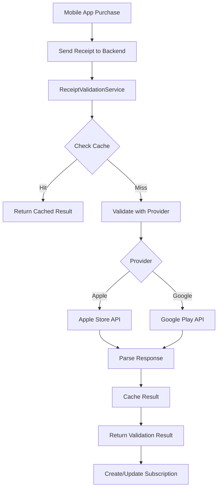

# Receipt Validation Guide - Lingible

## Overview

This guide covers the implementation of secure receipt validation for Apple Store and Google Play Store subscriptions in our Lingible app. Receipt validation is critical for preventing fraud and ensuring only legitimate payments grant premium access.

## Architecture

### **Receipt Validation Flow**



### **Security Layers**

1. **Provider Validation**: Direct API calls to Apple/Google
2. **Transaction Deduplication**: Prevent replay attacks
3. **Environment Validation**: Ensure correct sandbox/production
4. **Caching**: Reduce API calls and improve performance
5. **Audit Trail**: Complete logging of all validation attempts

## Apple Store Integration

### **Configuration**

Add to your SSM Parameter Store:

```json
{
  "/lingible-backend/production/apple_store": {
    "environment": "production",
    "shared_secret": "your_app_specific_shared_secret",
    "bundle_id": "com.lingible.lingible",
    "verify_url": "https://buy.itunes.apple.com/verifyReceipt",
    "sandbox_url": "https://sandbox.itunes.apple.com/verifyReceipt"
  }
}
```

### **Apple Store Receipt Validation**

```python
# Example usage in subscription service
validation_result = self.receipt_validator.validate_receipt(
    provider="apple",
    receipt_data=receipt_data,
    transaction_id=transaction_id,
    user_id=user_id
)

if validation_result.is_valid:
    # Process subscription
    pass
else:
    # Handle validation failure
    raise ValidationError(validation_result.error_message)
```

### **Apple Status Codes**

| Status Code | Meaning | Action |
|-------------|---------|--------|
| 0 | Valid | Process subscription |
| 21000 | Invalid JSON | Reject receipt |
| 21002 | Invalid receipt data | Reject receipt |
| 21003 | Receipt not authenticated | Reject receipt |
| 21004 | Shared secret mismatch | Check configuration |
| 21005 | Server unavailable | Retry later |
| 21006 | Receipt valid but expired | Reject subscription |
| 21007 | Sandbox receipt sent to production | Switch to sandbox URL |
| 21008 | Production receipt sent to sandbox | Switch to production URL |

### **Apple Receipt Structure**

```json
{
  "status": 0,
  "environment": "Production",
  "receipt": {
    "receipt_type": "ProductionSandbox",
    "bundle_id": "com.yourapp.genztranslator",
    "application_version": "1.0",
    "in_app": [
      {
        "quantity": "1",
        "product_id": "premium_monthly",
        "transaction_id": "1000000123456789",
        "original_transaction_id": "1000000123456789",
        "purchase_date": "2024-01-15 10:30:00 Etc/GMT",
        "purchase_date_ms": "1705312200000",
        "expires_date": "2024-02-15 10:30:00 Etc/GMT",
        "expires_date_ms": "1707990600000"
      }
    ]
  },
  "latest_receipt_info": [
    {
      "quantity": "1",
      "product_id": "premium_monthly",
      "transaction_id": "1000000123456790",
      "original_transaction_id": "1000000123456789",
      "purchase_date": "2024-02-15 10:30:00 Etc/GMT",
      "purchase_date_ms": "1707990600000",
      "expires_date": "2024-03-15 10:30:00 Etc/GMT",
      "expires_date_ms": "1710587400000"
    }
  ]
}
```

## Google Play Store Integration

### **Configuration**

Add to your SSM Parameter Store:

```json
{
  "/lingible-backend/production/google_play": {
    "package_name": "com.lingible.lingible",
    "service_account_key": "path/to/service-account-key.json",
    "api_timeout": 10
  }
}
```

### **Google Play Receipt Validation**

```python
# Example usage
validation_result = self.receipt_validator.validate_receipt(
    provider="google",
    receipt_data=receipt_data,
    transaction_id=transaction_id,
    user_id=user_id
)
```

### **Google Play Receipt Structure**

```json
{
  "orderId": "GPA.1234-5678-9012-34567",
          "packageName": "com.lingible.lingible",
  "productId": "premium_monthly",
  "purchaseTime": 1705312200000,
  "purchaseState": 0,
  "purchaseToken": "abc123def456...",
  "acknowledged": false
}
```

## Database Schema

### **Receipts Table**

```sql
CREATE TABLE receipts (
  transaction_id STRING PRIMARY KEY,
  is_valid BOOLEAN,
  status STRING,
  provider STRING,
  product_id STRING,
  purchase_date TIMESTAMP,
  expiration_date TIMESTAMP,
  environment STRING,
  error_message STRING,
  cached_at TIMESTAMP,
  used_for_subscription BOOLEAN,
  user_id STRING,
  used_at TIMESTAMP,
  ttl TIMESTAMP
);
```

### **DynamoDB Structure**

```json
{
  "transaction_id": "1000000123456789",
  "is_valid": true,
  "status": "valid",
  "provider": "apple",
  "product_id": "premium_monthly",
  "purchase_date": "2024-01-15T10:30:00Z",
  "expiration_date": "2024-02-15T10:30:00Z",
  "environment": "production",
  "cached_at": 1705312200,
  "used_for_subscription": true,
  "user_id": "user123",
  "used_at": 1705312200,
  "ttl": 1705398600
}
```

## Security Considerations

### **1. Shared Secret Management**

- Store Apple shared secret in SSM Parameter Store
- Use IAM roles to restrict access
- Rotate secrets regularly
- Never log or expose secrets

### **2. Transaction Deduplication**

```python
# Check for duplicate transactions
if self.receipt_validator.check_duplicate_transaction(transaction_id):
    raise ValidationError("Transaction already processed")
```

### **3. Environment Validation**

```python
# Ensure correct environment
if validation_result.status == ReceiptStatus.ENVIRONMENT_MISMATCH:
    raise ValidationError("Environment mismatch")
```

### **4. Rate Limiting**

- Implement rate limiting on validation endpoints
- Use caching to reduce API calls
- Monitor for suspicious patterns

### **5. Audit Logging**

```python
# Log all validation attempts
logger.log_business_event("receipt_validation_attempt", {
    "transaction_id": transaction_id,
    "provider": provider,
    "user_id": user_id,
    "ip_address": request_ip,
    "user_agent": user_agent
})
```

## Error Handling

### **Retry Logic**

```python
# Handle retryable errors
if validation_result.status == ReceiptStatus.RETRYABLE_ERROR:
    # Queue for retry
    retry_after = validation_result.retry_after or 60
    # Implement retry mechanism
```

### **Graceful Degradation**

```python
# Fallback for provider outages
try:
    result = validate_with_provider()
except ProviderUnavailableError:
    # Use cached result or implement fallback
    result = get_cached_validation()
```

## Monitoring and Alerting

### **Key Metrics**

1. **Validation Success Rate**: Track successful vs failed validations
2. **Provider Response Time**: Monitor API performance
3. **Cache Hit Rate**: Optimize caching strategy
4. **Error Rates**: Alert on high error rates
5. **Duplicate Attempts**: Detect potential fraud

### **CloudWatch Alarms**

```yaml
ReceiptValidationErrorRate:
  Type: AWS::CloudWatch::Alarm
  Properties:
    MetricName: ReceiptValidationErrors
    Namespace: Lingible/ReceiptValidation
    Statistic: Sum
    Period: 300
    EvaluationPeriods: 2
    Threshold: 10
    ComparisonOperator: GreaterThanThreshold
```

## Testing

### **Unit Tests**

```python
def test_apple_receipt_validation():
    # Test valid receipt
    result = validator.validate_receipt("apple", valid_receipt, "txn123")
    assert result.is_valid == True
    assert result.status == ReceiptStatus.VALID

def test_duplicate_transaction():
    # Test duplicate prevention
    validator.mark_transaction_used("txn123", "user123")
    assert validator.check_duplicate_transaction("txn123") == True
```

### **Integration Tests**

```python
def test_end_to_end_subscription_flow():
    # Test complete subscription flow
    receipt_data = get_test_receipt()
    result = subscription_service.upgrade_user(
        user_id="user123",
        provider="apple",
        receipt_data=receipt_data,
        transaction_id="txn123"
    )
    assert result.tier == UserTier.PREMIUM
```

### **Load Testing**

```python
def test_concurrent_validations():
    # Test concurrent validation requests
    with concurrent.futures.ThreadPoolExecutor(max_workers=10) as executor:
        futures = [
            executor.submit(validate_receipt, receipt_data, f"txn{i}")
            for i in range(100)
        ]
        results = [future.result() for future in futures]
        assert all(result.is_valid for result in results)
```

## Deployment Checklist

### **Pre-Deployment**

- [ ] Configure Apple shared secret in SSM
- [ ] Set up Google Play service account
- [ ] Create receipts DynamoDB table
- [ ] Configure CloudWatch alarms
- [ ] Set up monitoring dashboards

### **Deployment**

- [ ] Deploy receipt validation service
- [ ] Update subscription service
- [ ] Test with sandbox receipts
- [ ] Verify error handling
- [ ] Check monitoring alerts

### **Post-Deployment**

- [ ] Monitor validation success rates
- [ ] Check cache performance
- [ ] Verify audit logging
- [ ] Test error scenarios
- [ ] Document any issues

## Troubleshooting

### **Common Issues**

1. **Invalid Shared Secret**
   - Check SSM parameter configuration
   - Verify Apple App Store Connect settings
   - Ensure correct app bundle ID

2. **Environment Mismatch**
   - Check environment configuration
   - Verify sandbox vs production URLs
   - Ensure test receipts use sandbox

3. **Network Timeouts**
   - Check Lambda timeout settings
   - Verify VPC configuration
   - Monitor provider API status

4. **Duplicate Transactions**
   - Check DynamoDB table permissions
   - Verify transaction ID uniqueness
   - Review concurrent request handling

### **Debug Commands**

```bash
# Check SSM parameters
aws ssm get-parameter --name "/mobile-app-backend/production/apple_store"

# Check DynamoDB table
aws dynamodb scan --table-name mobile-app-backend-receipts-production

# Check CloudWatch logs
aws logs filter-log-events --log-group-name "/aws/lambda/receipt-validation"
```

## Best Practices

1. **Always validate receipts server-side**
2. **Implement proper error handling**
3. **Use caching to reduce API calls**
4. **Monitor and alert on failures**
5. **Keep secrets secure**
6. **Test with sandbox receipts first**
7. **Implement retry logic for transient failures**
8. **Log all validation attempts for audit**
9. **Use environment-specific configurations**
10. **Regularly review and update security measures**

## Conclusion

Proper receipt validation is essential for maintaining the integrity of your subscription system. This implementation provides:

- **Security**: Prevents fraud and replay attacks
- **Reliability**: Handles provider outages gracefully
- **Performance**: Uses caching to reduce API calls
- **Monitoring**: Comprehensive logging and alerting
- **Scalability**: Designed for high-volume validation

Follow this guide to implement a robust, production-ready receipt validation system for your GenZ slang translation app.
