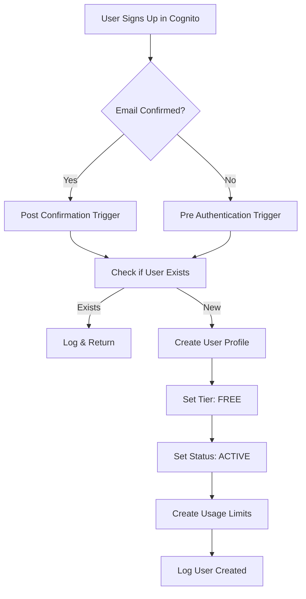
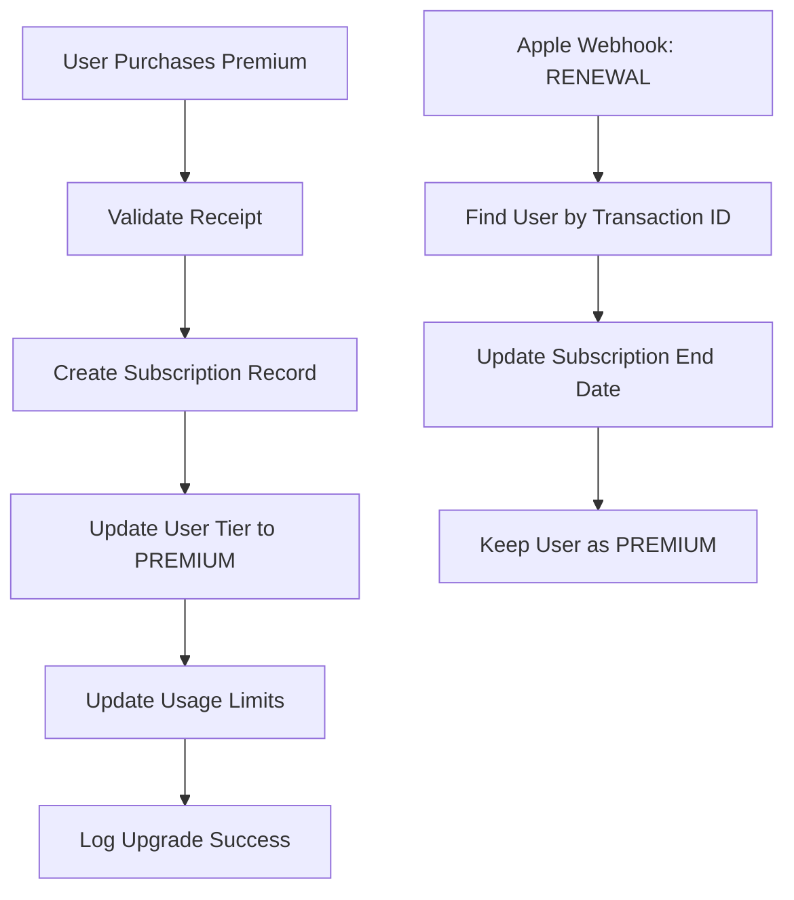
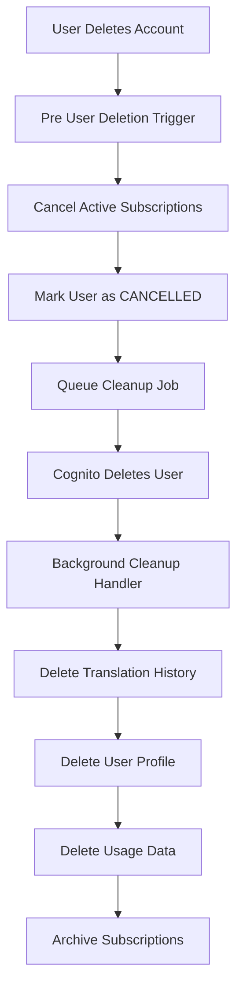
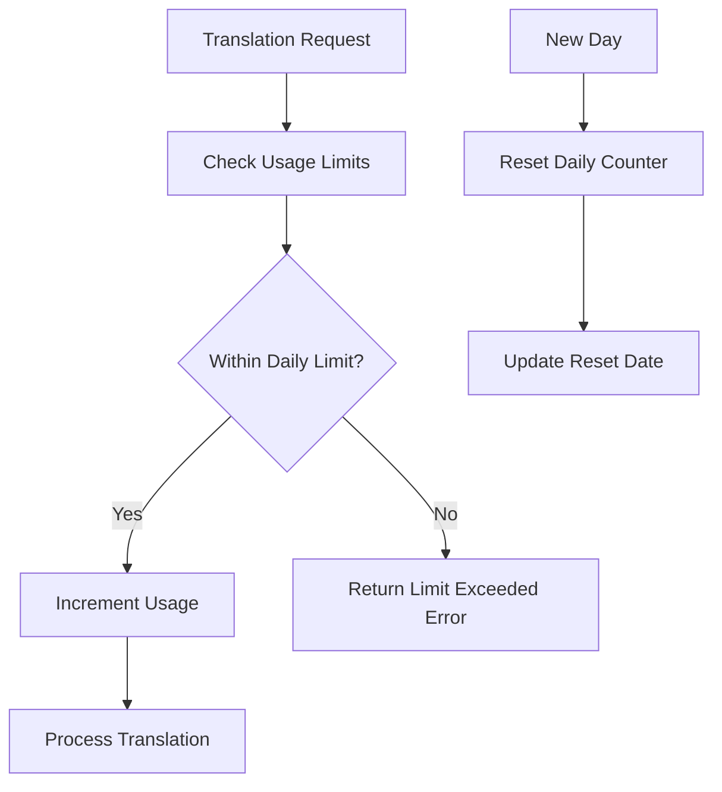

# User Lifecycle Analysis - GenZ Slang Translation App

## Executive Summary

This document provides a comprehensive analysis of the user lifecycle in our GenZ slang translation app, covering all stages from user creation through deletion and archival. The analysis reveals a well-structured system with some areas for improvement in data consistency, error handling, and operational efficiency.

## User Lifecycle Overview

### 1. User Creation Flow

#### **Entry Points:**
- **Cognito Post Confirmation Trigger** (`cognito_post_confirmation.py`)
- **Cognito Pre Authentication Trigger** (`cognito_pre_authentication.py`)

#### **Creation Process:**


#### **Database State After Creation:**
```
USER#123 | PROFILE        | {user_id, username, email, tier: FREE, status: ACTIVE, created_at, updated_at, ttl: 1 year}
USER#123 | USAGE#LIMITS   | {tier: FREE, daily_used: 0, reset_daily_at: today_start, updated_at, ttl: 1 year}
```

#### **Key Observations:**
- ✅ **Dual Trigger System**: Handles both direct signup and "Sign in with Apple" users
- ✅ **Idempotent Creation**: Checks for existing users before creation
- ✅ **Default Tier Assignment**: All users start as FREE tier
- ✅ **Usage Limits Initialization**: Automatic creation of usage tracking
- ⚠️ **TTL on User Profile**: 1-year TTL might be too aggressive for active users

### 2. User Upgrade Flow

#### **Entry Points:**
- **User Upgrade Handler** (`user_upgrade_handler.py`) - `POST /user/upgrade`
- **Apple Webhook Handler** (`apple_webhook_handler.py`) - `POST /webhooks/apple/subscription`

#### **Upgrade Process:**


#### **Database State After Upgrade:**
```
USER#123 | PROFILE        | {tier: PREMIUM, status: ACTIVE, updated_at}
USER#123 | USAGE#LIMITS   | {tier: PREMIUM, daily_used: 0, reset_daily_at: today_start}
USER#123 | SUBSCRIPTION#ACTIVE | {provider: apple, transaction_id, status: ACTIVE, start_date, end_date, ttl: 1 year}
```

#### **Key Observations:**
- ✅ **Receipt Validation**: Framework in place for provider validation
- ✅ **Subscription Tracking**: Separate subscription records with TTL
- ✅ **Tier Synchronization**: User tier and usage limits updated together
- ⚠️ **Transaction ID Lookup**: GSI not implemented for efficient lookups
- ⚠️ **Receipt Validation**: Currently simplified (TODO implementation)

### 3. User Downgrade Flow

#### **Entry Points:**
- **Apple Webhook Handler** - `CANCEL` notification
- **Apple Webhook Handler** - `FAILED_PAYMENT` notification

#### **Downgrade Process:**
```mermaid
graph TD
    A[Apple Webhook: CANCEL] --> B[Find User by Transaction ID]
    B --> C[Cancel Active Subscription]
    C --> D[Archive Subscription to History]
    D --> E[Update User Tier to FREE]
    E --> F[Update Usage Limits]

    G[Apple Webhook: FAILED_PAYMENT] --> H[Find User by Transaction ID]
    H --> I[Mark Subscription as EXPIRED]
    I --> J[Keep User Tier (for grace period)]
```

#### **Database State After Downgrade:**
```
USER#123 | PROFILE        | {tier: FREE, status: ACTIVE, updated_at}
USER#123 | USAGE#LIMITS   | {tier: FREE, daily_used: 0, reset_daily_at: today_start}
USER#123 | SUBSCRIPTION#HISTORY#txn1 | {status: cancelled, cancelled_at, ttl: 1 year}
```

#### **Key Observations:**
- ✅ **Subscription Archiving**: Cancelled subscriptions moved to history
- ✅ **Tier Downgrade**: User tier properly updated to FREE
- ✅ **TTL on History**: Automatic cleanup after 1 year
- ⚠️ **Grace Period**: No grace period for failed payments
- ⚠️ **User Notification**: No mechanism to notify users of status changes

### 4. User Deletion Flow

#### **Entry Points:**
- **Cognito Pre User Deletion Trigger** (`cognito_pre_user_deletion.py`)
- **User Data Cleanup Handler** (`user_data_cleanup.py`)

#### **Deletion Process:**


#### **Database State During Deletion:**
```
# After Pre-Deletion Trigger
USER#123 | PROFILE        | {status: CANCELLED, updated_at}
USER#123 | SUBSCRIPTION#HISTORY#txn1 | {status: cancelled, cancelled_at, ttl: 1 year}

# After Background Cleanup
USER#123 | SUBSCRIPTION#HISTORY#txn1 | {status: cancelled, cancelled_at, ttl: 1 year}
# All other records deleted

# After 1 Year (TTL Expiration)
# Complete user deletion - nothing left
```

#### **Key Observations:**
- ✅ **Soft Delete**: User marked as CANCELLED before hard deletion
- ✅ **Comprehensive Cleanup**: All user data properly cleaned up
- ✅ **Subscription Archiving**: Subscription history preserved with TTL
- ✅ **Non-blocking Deletion**: Background cleanup doesn't block Cognito
- ⚠️ **Cleanup Queue**: SQS/Step Functions not implemented (TODO)
- ⚠️ **Partial Cleanup**: If cleanup fails, orphaned data may remain

### 5. Usage Tracking Flow

#### **Daily Usage Management:**


#### **Usage Data Structure:**
```
USER#123 | USAGE#LIMITS | {
  tier: FREE/PREMIUM,
  daily_used: 0-20,
  reset_daily_at: datetime,
  updated_at: datetime,
  ttl: 1 year
}
```

#### **Key Observations:**
- ✅ **Atomic Operations**: Usage increment uses DynamoDB atomic updates
- ✅ **Daily Reset**: Automatic reset based on date comparison
- ✅ **Tier Synchronization**: Usage limits reflect current user tier
- ✅ **Limit Enforcement**: Translation service checks limits before processing
- ⚠️ **Monthly Limits**: Only daily limits implemented
- ⚠️ **Usage Analytics**: No historical usage tracking for analytics

## Critical Issues and Recommendations

### 🔴 **High Priority Issues**

#### 1. **Incomplete Receipt Validation**
**Issue**: Receipt validation is currently simplified and returns `True` for all requests.
```python
def _validate_receipt(self, provider: str, receipt_data: str, transaction_id: str) -> bool:
    # TODO: Implement actual receipt validation with Apple/Google APIs
    # For now, just return True for testing
    return True
```

**Recommendation**:
- Implement proper Apple Store receipt validation using their verification API
- Add Google Play Store receipt validation for future expansion
- Add receipt validation caching to reduce API calls
- Implement retry logic for validation failures

#### 2. **Missing Transaction ID Lookup**
**Issue**: Finding users by transaction ID requires a GSI that's not implemented.
```python
def find_by_transaction_id(self, transaction_id: str) -> Optional[UserSubscription]:
    # TODO: Implement GSI query on transaction_id
    # For now, this is a placeholder
    return None
```

**Recommendation**:
- Create GSI on `transaction_id` field for efficient lookups
- Add index to DynamoDB table configuration
- Update repository to use GSI for transaction lookups

#### 3. **Incomplete Cleanup Queue**
**Issue**: Background cleanup is logged but not actually queued.
```python
# TODO: Send to SQS or invoke cleanup handler directly
# For now, we'll log that cleanup should be queued
```

**Recommendation**:
- Implement SQS queue for cleanup jobs
- Add Step Functions for complex cleanup workflows
- Add cleanup job monitoring and retry logic
- Implement cleanup job status tracking

### 🟡 **Medium Priority Issues**

#### 4. **Aggressive TTL on User Profiles**
**Issue**: User profiles have 1-year TTL, which may be too aggressive for active users.
```python
"ttl": int(datetime.now(timezone.utc).timestamp() + (365 * 24 * 60 * 60))
```

**Recommendation**:
- Remove TTL from active user profiles
- Only apply TTL to cancelled users
- Implement separate cleanup process for inactive users
- Add user activity tracking for retention analysis

#### 5. **No Grace Period for Failed Payments**
**Issue**: Failed payments immediately expire subscriptions without grace period.
```python
def _handle_failed_payment(self, user: User) -> bool:
    subscription.status = SubscriptionStatus.EXPIRED
    # No grace period implemented
```

**Recommendation**:
- Implement configurable grace period (e.g., 7 days)
- Add multiple failed payment tracking
- Send notification emails for failed payments
- Allow manual payment retry

#### 6. **Missing User Notifications**
**Issue**: No mechanism to notify users of subscription status changes.

**Recommendation**:
- Implement SNS/SES for email notifications
- Add push notification support
- Create notification templates for different events
- Add notification preferences to user profile

### 🟢 **Low Priority Improvements**

#### 7. **Limited Usage Analytics**
**Issue**: Only daily usage tracking, no historical analytics.

**Recommendation**:
- Add monthly usage tracking
- Implement usage analytics dashboard
- Add usage trend analysis
- Create usage reports for business intelligence

#### 8. **No Subscription History API**
**Issue**: No way for users to view their subscription history.

**Recommendation**:
- Add subscription history endpoint
- Implement subscription status API
- Add subscription management UI
- Create subscription analytics

#### 9. **Missing User Preferences**
**Issue**: No user preferences or settings storage.

**Recommendation**:
- Add user preferences model
- Implement preferences API
- Add language/translation preferences
- Create user settings management

## Database Schema Recommendations

### **Current Schema Issues:**
1. **TTL on Active Users**: Should be removed
2. **Missing GSI**: Need transaction_id index
3. **No Soft Delete**: Consider soft delete for all records
4. **Limited Analytics**: Need historical data structures

### **Recommended Schema Changes:**
```sql
-- Add GSI for transaction lookups
CREATE GSI transaction_id_index ON users_table
  (transaction_id, PK, SK)

-- Add GSI for subscription status
CREATE GSI subscription_status_index ON users_table
  (subscription_status, PK, SK)

-- Add GSI for user tier analytics
CREATE GSI tier_analytics_index ON users_table
  (tier, created_at, PK)
```

## Monitoring and Alerting Recommendations

### **Critical Metrics to Monitor:**
1. **User Creation Rate**: Track signup success/failure rates
2. **Subscription Conversion**: Monitor free-to-premium conversion
3. **Payment Failure Rate**: Track failed payment percentages
4. **Cleanup Job Success**: Monitor data cleanup completion rates
5. **Usage Limit Exceeded**: Track when users hit limits

### **Recommended Alerts:**
- High payment failure rate (>5%)
- Cleanup job failures
- User creation failures
- Subscription webhook failures
- Usage limit exceeded spikes

## Testing Recommendations

### **Unit Tests Needed:**
1. **Receipt Validation**: Test Apple/Google receipt validation
2. **Usage Tracking**: Test daily reset and limit enforcement
3. **Subscription Lifecycle**: Test upgrade/downgrade flows
4. **Cleanup Process**: Test data deletion and archiving
5. **Error Handling**: Test all error scenarios

### **Integration Tests Needed:**
1. **Cognito Triggers**: Test user creation flows
2. **Webhook Processing**: Test Apple webhook handling
3. **End-to-End Flows**: Test complete user journeys
4. **Database Operations**: Test DynamoDB operations
5. **Error Recovery**: Test failure scenarios

## Conclusion

The user lifecycle implementation is well-structured with clear separation of concerns and proper error handling. The main areas for improvement are:

1. **Complete the TODO items** (receipt validation, GSI implementation, cleanup queue)
2. **Add monitoring and alerting** for critical user flows
3. **Implement user notifications** for important events
4. **Add analytics and reporting** for business intelligence
5. **Improve testing coverage** for all user flows

The foundation is solid, and these improvements will create a robust, production-ready user management system.
