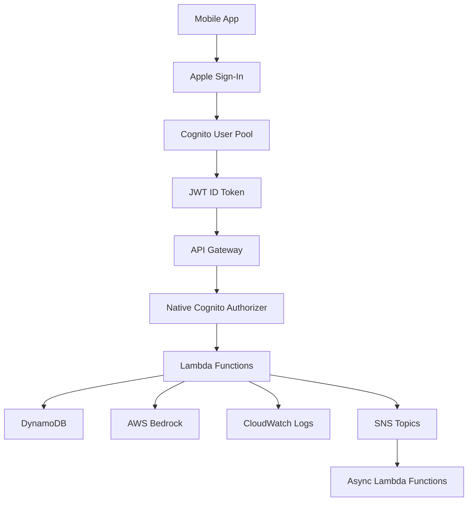

# Lingible Architecture

## Overview

Lingible is a serverless GenZ slang translation application built on AWS. All requests flow through API Gateway, which authenticates users via Cognito and routes to Lambda functions that handle business logic and data access.

## System Architecture

## Core Components

### API Gateway
- **Single Entry Point**: All API requests flow through API Gateway
- **Native Cognito Authorizer**: Validates JWT tokens at the gateway level
- **Benefits**:
  - Prevents unauthorized requests from reaching Lambda
  - Reduces Lambda invocations for invalid tokens
  - Centralized CORS and rate limiting
  - Lower cost (no custom authorizer Lambda needed)

### Authentication & Authorization

#### Authentication Flow
1. User authenticates with Apple Sign-In via Cognito
2. Cognito issues JWT ID token
3. Mobile app includes token in `Authorization: Bearer <token>` header
4. API Gateway authorizer validates token before request reaches Lambda

#### Authorization Levels

**Public Endpoints** (no authorizer):
- Health checks
- Public documentation

**Protected Endpoints** (Cognito authorizer):
- All user-facing APIs
- User context available via `event.requestContext.authorizer.claims`

**Business Logic Authorization**:
- Tier checks (free vs premium features)
- Resource ownership validation
- Admin-only operations

#### Token Structure

JWT claims available in Lambda handlers:
- `sub`: User ID (unique identifier)
- `email`: User email address
- `custom:user_tier`: User tier (free, premium)
- `aud`, `iss`, `exp`, `iat`: Standard JWT claims

### Lambda Functions

#### API Handlers (`*_api` directories)
Handle synchronous API requests:
- `translate_api`: Text translation (English ↔ GenZ slang)
- `user_api`: User profile and usage management
- `quiz_*_api`: Quiz generation, answering, history
- `slang_submission_api`: User slang term submissions
- `trending_api`: Trending terms and analytics
- `subscription_api`: Subscription management
- `admin_*_api`: Admin moderation and configuration

#### Async Handlers (`*_async` directories)
Process background jobs triggered by SNS:
- `slang_validation_async`: Validates user-submitted slang terms using LLM
- `export_lexicon_async`: Exports lexicon data to S3
- `trending_job_async`: Generates trending term lists

#### Cognito Triggers (`*_trigger` directories)
Handle Cognito lifecycle events:
- `cognito_post_confirmation_trigger`: Creates user in DynamoDB after email confirmation
- `cognito_pre_authentication_trigger`: Ensures user exists before login (handles Apple Sign-In)
- `cognito_pre_user_deletion_trigger`: Marks user as cancelled and queues cleanup

### Data Layer

#### DynamoDB Tables
- **UsersTable**: User profiles, usage limits, quiz sessions
- **TranslationsTable**: User translation history
- **SubmissionsTable**: User-submitted slang terms awaiting moderation
- **LexiconTable**: Canonical lexicon entries with quiz metadata
- **TrendingTable**: Trending term analytics (90-day TTL)

See `docs/database-schema.md` for complete table and index definitions.

#### Repository Pattern
Data access is abstracted through repository classes:
- `UserRepository`: User CRUD and usage tracking
- `TranslationRepository`: Translation history management
- `SubmissionsRepository`: Submission moderation workflow
- `LexiconRepository`: Lexicon CRUD and quiz term retrieval
- `TrendingRepository`: Trending analytics
- `SubscriptionRepository`: Subscription management

See `docs/repositories.md` for repository responsibilities.

### Service Layer

Business logic is implemented in service classes:
- `TranslationService`: Orchestrates translation (lexicon matching, LLM fallback)
- `UserService`: User management, tier upgrades, usage limits
- `QuizService`: Quiz generation, scoring, session management
- `SlangSubmissionService`: Submission validation and moderation
- `SlangValidationService`: LLM-based validation of submissions
- `TrendingService`: Trending term generation and analytics
- `SubscriptionService`: Apple StoreKit validation and subscription management

### External Services

- **AWS Bedrock**: LLM inference for translation and validation
- **Tavily API**: Web search for slang term validation
- **Apple App Store Server API**: Subscription validation
- **S3**: Lexicon exports and static website hosting

## Request Flow Example

### Translation Request

1. Mobile app sends `POST /translate` with JWT token
2. API Gateway validates token via Cognito authorizer
3. Request routed to `translate_api` Lambda
4. `TranslationService` orchestrates:
   - `SlangLexiconService`: Check lexicon for matches
   - `SlangMatchingService`: Pattern matching
   - `SlangLLMService`: Bedrock fallback if no match
5. Result stored in `TranslationsTable` (if user tier allows)
6. Response returned to mobile app

### Slang Submission Flow

1. User submits slang term via `POST /slang/submit`
2. `SlangSubmissionService` validates input
3. Submission saved to `SubmissionsTable` with status `pending_validation`
4. SNS message published to `slangSubmissionsTopic`
5. `slang_validation_async` Lambda triggered
6. `SlangValidationService` validates using LLM + web search
7. Submission status updated (validated, auto_approved, or rejected)
8. If approved, term added to `LexiconTable`

## Security

### Secrets Management
- **SSM Parameter Store**: Apple IAP private key, Tavily API key (SecureString)
- **Secrets Manager**: Cognito Apple Sign-In credentials (CDK-managed)
- **IAM**: Least-privilege access per Lambda function

### Data Protection
- DynamoDB encryption at rest (SSE enabled)
- Point-in-time recovery enabled for critical tables
- TTL on sensitive data (trending analytics, quiz sessions)

See `docs/security.md` for detailed security practices.

## Monitoring & Observability

- **CloudWatch Logs**: All Lambda functions log to `/aws/lambda/{function-name}`
- **CloudWatch Metrics**: API Gateway, Lambda invocation/duration/errors
- **X-Ray Tracing**: Distributed tracing (optional, configurable)
- **Structured Logging**: AWS Lambda Powertools Logger with context

## Benefits of This Architecture

- **Security**: Centralized authentication, least-privilege IAM
- **Scalability**: Serverless auto-scaling, no infrastructure management
- **Cost Efficiency**: Pay per request, no idle resources
- **Maintainability**: Clear separation of concerns, testable components
- **Developer Experience**: Type-safe models, comprehensive test coverage
