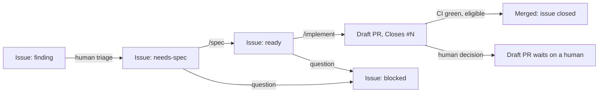

# Lingible Agent Development Protocol

The repository is the durable coordination system. GitHub Issues are the work queue. Specs under
`specs/` are the living behavior contracts. Nothing important depends on any tool's chat memory.

Adapted from the same pattern used on the `allong` project. Simplified for Lingible's scale (one
active developer, one backend + one iOS client) but the mechanics — issue-as-queue, isolated
review, spec-before-code, PR-only delivery — are unchanged.

## The pipeline

Three skills, one entry point:

| Skill | Picks up | Produces |
|---|---|---|
| `/spec <issue>` | an issue labeled `needs-spec` | an approved spec (new file, or a delta recorded on the issue), issue relabeled `ready` |
| `/implement <issue>` | an issue labeled `ready` whose dependencies are done | one PR that closes the issue |
| `/pipeline [implement\|spec]` | nothing in particular | runs `/implement` or `/spec` on the next eligible issue in its lane, one run per lane at a time |

`/pipeline` is what a scheduled routine can run unattended (one per lane, if/when Tyler sets that
up — see "Human-owned infrastructure" below) and what a human runs interactively to "do the next
thing". The two lanes are independent and each is single-flight: at most one implement run and one
spec run at a time, never two of the same kind. A spec run only needs its dependencies' designs
locked, so specs run ahead of code, and a draft PR waiting on a human holds the implement lane
without stalling spec work.

## Issues are the queue

One issue per capability or per change to an implemented capability. The issue title is the
capability name from `ROADMAP.md` when one applies. Labels carry the queue state:

| Label | Meaning |
|---|---|
| `needs-spec` | accepted work, no approved spec yet |
| `ready` | spec approved; waiting for implementation |
| `in-progress:implement` | an implement run has claimed it (see Claims) |
| `in-progress:spec` | a spec run has claimed it (see Claims) |
| `blocked` | a human decision is needed; the question is the latest comment |
| `finding` | agent-discovered, out-of-scope; a human decides whether it becomes `needs-spec` |

"Done" is not a label: the implementing PR says `Closes #N` and GitHub closes the issue on merge.

### Claims

Before starting `/implement` or `/spec` on an issue, add that lane's label (`in-progress:implement`
or `in-progress:spec`) and post one comment: `Pipeline claimed <RFC3339 UTC>`. Release by removing
the lane label (and restoring `ready` or `needs-spec`) when the run ends without merging. A claim
whose comment is older than three hours with no open PR referencing the issue is stale; `/pipeline`
removes it and treats the issue as free. Claims are API calls, never commits.

A lane is busy while any open issue carries its label. `/pipeline` checks only its own lane, so
the implement lane and the spec lane never wait on each other. Two runs of the same lane must never
be active at once: a human running `/spec` or `/implement` directly is expected to check the lane
first, the same way `/pipeline` does.

### Dependencies

`ROADMAP.md`'s table lists what each capability depends on. A dependency is satisfied for
`/implement` when it has at least one `implemented` spec and no open issue carries its name. For
`/spec`, a dependency only needs an `approved` or `implemented` spec (its design is locked).

### Findings

Anything real but outside the current issue's scope (a bug elsewhere, missing infra, a doc gap)
becomes a new issue labeled `finding`, with enough detail to act on later. It is never fixed inline
and never auto-drafted into a spec. A human triages findings by relabeling to `needs-spec` or
closing them; no agent relabels a `finding` on its own judgment.

When filing a finding, append one line, `Suggested triage: needs-spec` or
`Suggested triage: human-judgment-needed`, with a one-line reason. Suggest `needs-spec` only when
the gap is in already-implemented or already-approved behavior and closing it involves no product,
UX, cost, or architecture tradeoff — a pure omission, not a decision. Anything else, including
every case that is merely convincing rather than clearly mechanical, gets
`human-judgment-needed`. The suggestion speeds up triage; it never substitutes for it.

## Specs are living contracts

- One spec file per coherent behavior, following `specs/TEMPLATE.md`. Split only when
  authorization differs materially, parts ship independently, or the combined spec is too large to
  reason about.
- `status` moves `draft` → `approved` → `implemented`. `retired` marks a spec whose behavior no
  longer exists. A spec is `approved` only after the isolated spec review passed.
- **Modifying an implemented capability edits its spec in place.** `/spec` records the change as a
  delta on the issue (`## Proposed change` with `ADDED`, `MODIFIED`, `REMOVED` sections), the spec
  reviewer reviews the delta against the current spec, and `/implement` applies the spec edit and
  the code in the same PR. No addendum sections, no sibling "amendment" files, no re-stamping.
- A bug fix where the spec was already right needs no spec change.
- Provenance is git: the PR that closed the issue, and `git log` on the spec file.

### Decision classes

Every non-obvious choice a spec makes is classified: `DERIVED` (implied by canonical docs),
`IMPLEMENTATION` (a technical choice within approved architecture), or `ESCALATED` (new product,
security, cost, retention, contract, or architecture policy the docs do not resolve). Only
`ESCALATED` stops for a human, via the `blocked` label.

### Cost impact (Bedrock is Lingible's dominant variable cost)

Lingible runs on a per-user-cost-sensitive freemium model, and AWS Bedrock is consistently ~90% of
per-request cost (`docs/COST_ANALYSIS.md`). Any spec that adds, removes, or changes an LLM call
(translation, slang validation, trending generation, or a new capability that calls Bedrock),
changes the model used, changes prompt length/structure, or changes a tier's usage limits must
include a **Cost impact** consideration (part of the spec's Architecture impact section): the
expected per-request token/cost delta and whether `docs/COST_ANALYSIS.md` needs updating as part
of the implementing PR. Treat a meaningful, un-budgeted per-request cost increase (materially
longer prompts, a materially more expensive model, removal of the lexicon-matching pre-filter
without a replacement mitigation) the same as any other `ESCALATED` decision: it stops for a human
rather than being decided autonomously, even when the code change itself is small.

This is backed by a mechanical check, not just spec/review judgment:
`scripts/check_bedrock_cost_review.py` (run by `./scripts/verify` and in CI) diffs against
`origin/main` and fails whenever a known Bedrock-cost-relevant file changes
(`slang_llm_service.py`, `slang_validation_service.py`, `trending_service.py`, `LLMConfig`, or the
`llm`/`limits` blocks in `shared/config/backend/{dev,prod}.json`) without `docs/COST_ANALYSIS.md`
also changing in the same diff — independent of whether a spec correctly predicted the change would
touch Bedrock. A change with no real cost impact still needs a one-line entry in that doc's "Recent
changes reviewed" table saying so; that's what satisfies the check. The script also scans every
added line in the whole diff for Bedrock-call signatures (`invoke_model`, `bedrock_client`, etc.),
so a genuinely new Bedrock call site in a file not yet on that known list is still caught — but an
implementation that adds one **must** also add the file to that script's `WATCHED` list in the same
PR (`agents/code-reviewer.md` blocks on this), so later changes to it are named explicitly rather
than depending on the signature scan alone every time.

## Isolation principle

Two roles exist to catch what the producing session cannot see about its own work:
`agents/spec-reviewer.md` (reviews a spec or delta) and `agents/code-reviewer.md` (reviews the
implementation, including cost verification when the spec touches Bedrock usage). Each runs as a
fresh-context subagent invocation, never as the producing session changing hats.
`agents/spec-agent.md` and the implementation itself run inline.

Each reviewer gets one repair round. A second failing round ends the run at `blocked` with the
findings on the issue, so a human sees a converging record rather than a loop.

## Delivery

- Every write to the repository goes through a PR against `main`. No agent pushes to `main`
  directly. Branches: `spec/<slug>` for spec PRs, `impl/<slug>` for implementation PRs.
- The implementation PR flips the spec to `status: implemented` in the same diff, uses the
  repository PR template, and says `Closes #N`.
- A spec-only PR's title and body must never contain a GitHub closing keyword (`close`, `closes`,
  `closed`, `fix`, `fixes`, `fixed`, `resolve`, `resolves`, `resolved`) followed by `#N`, in any
  formatting — not even quoted or set in backticks, since GitHub's closing-keyword parser matches
  through formatting. Refer to the convention in prose instead of spelling out the phrase.
- CI (`.github/workflows/verify.yml`) must be green. `./scripts/verify` runs the same checks
  locally and should be run before every push.
- Merge autonomously (squash) when the spec is `approval: autonomous` and no stage raised a human
  decision. Otherwise leave the PR as a draft and notify a human.
- Before implementing, run `python3 scripts/check_spec_freshness.py <spec>`. If any doc the spec
  cites changed since the spec was last edited, run the spec reviewer once against the current
  docs before writing code.

## Deploys stay separate from CI

CI (`.github/workflows/verify.yml`) validates — tests, lint, type checks, the CDK TypeScript build
— it never deploys. `npm run deploy:dev` / `npm run deploy:prod` from `backend/cdk/` remain the
only way anything reaches AWS. This is a deliberate, standing choice for this repo (unlike
`allong`, which does run an automated deploy pipeline): keep deploys a single-person action a human
explicitly starts each time, never something a pipeline routine or CI reaches on its own.

A deploy may be run through the `/deploy` skill (`.claude/skills/deploy/`), which sets up the local
toolchain and runs build/test/deploy — but only when a human explicitly invokes `/deploy` in an
interactive session for that specific run, and only after it states what it is about to run (target
environment, and for prod, the diff/changeset) and gets an explicit go-ahead before the deploy
command itself executes. `/deploy` must never be invoked by `/pipeline`, `/implement`, `/spec`, an
unattended routine, or any other automated flow — those stay confined to spec/review/PR delivery
work and stop short of this step, exactly as before. This carve-out changes *how* a human-initiated
deploy is executed, not *who* decides to deploy: the standing "no agent deploy without an explicit,
same-turn human ask" rule from "Human-owned infrastructure" below still applies in full.

## Notify a human

Notify only when a run ends at `blocked`, leaves a draft PR waiting on a human merge decision, or
created `finding` issues. Never for a clean autonomous completion. In Claude Code the mechanism is
the `PushNotification` tool: one message under 200 characters leading with what the human would act
on (the issue and the blocker, or the PR and why it is waiting).

## Human-owned infrastructure

Any scheduled/unattended `/pipeline` routine, its schedule, and any GitHub secrets are provisioned
by a human. Agents report problems with them and propose fixes; they do not create, delete, or
reconfigure such automation without explicit in-conversation authorization for that specific
action. As of this writing, no unattended routine is configured — `/pipeline` is run interactively
by Tyler until he decides otherwise.

## Switching AI tools

A new tool needs only the git tree, `AGENTS.md`, the current issue and spec(s), the canonical docs
they cite, and `./scripts/verify`. `.claude/` is a thin adapter over the same `agents/` role files.
