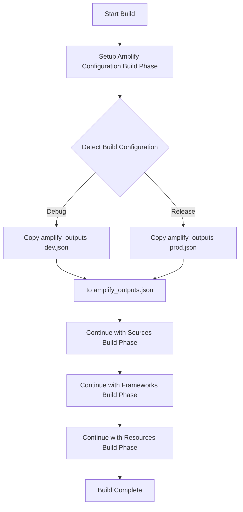

# iOS Build Process Documentation

## Overview

The iOS build process has been automated to handle environment-specific Amplify configuration files. This ensures that the correct configuration is used for each build configuration (Debug/Release) without manual intervention.

## Build Phase Configuration

### Setup Amplify Configuration Build Phase

A custom build phase has been added to the Xcode project that automatically runs before each build:

- **Name**: "Setup Amplify Configuration"
- **Script**: `"$SRCROOT/scripts/setup-amplify-config.sh"`
- **Run Order**: Before Sources, Frameworks, and Resources

### How It Works

1. **Build Phase Execution**: When you build the project, Xcode automatically runs the setup script
2. **Environment Detection**: The script detects the current build configuration (Debug/Release)
3. **Configuration Copying**: It copies the appropriate Amplify configuration file:
   - **Debug builds**: Uses `amplify_outputs-dev.json` → `amplify_outputs.json`
   - **Release builds**: Uses `amplify_outputs-prod.json` → `amplify_outputs.json`

## Configuration Files

### Environment-Specific Files

- `amplify_outputs-dev.json` - Development environment configuration
- `amplify_outputs-prod.json` - Production environment configuration
- `amplify_outputs.json` - Active configuration (automatically managed)

### Setup Script

The setup script (`scripts/setup-amplify-config.sh`) handles:
- Build configuration detection
- Appropriate config file copying
- Error handling and logging

## Build Process Flow



## Manual Override

If you need to manually set the configuration:

```bash
# For development
cp Lingible/amplify_outputs-dev.json Lingible/amplify_outputs.json

# For production
cp Lingible/amplify_outputs-prod.json Lingible/amplify_outputs.json
```

## Troubleshooting

### Build Phase Not Running

If the build phase isn't executing:

1. Check that the build phase exists in the Xcode project
2. Verify the script path is correct: `"$SRCROOT/scripts/setup-amplify-config.sh"`
3. Ensure the script has execute permissions: `chmod +x scripts/setup-amplify-config.sh`

### Wrong Configuration

If the wrong configuration is being used:

1. Check the current `amplify_outputs.json` file
2. Verify the build configuration in Xcode
3. Manually run the setup script: `./scripts/setup-amplify-config.sh`

### Script Errors

If the setup script fails:

1. Check script permissions: `ls -la scripts/setup-amplify-config.sh`
2. Run the script manually to see error output
3. Verify the configuration files exist

## Benefits

- **Automated**: No manual file copying required
- **Environment-Safe**: Correct configuration for each build
- **Consistent**: Same process for all developers
- **Reliable**: Reduces human error in configuration management

## Future Enhancements

- Add validation to ensure configuration files are valid
- Add support for additional build configurations
- Add logging to track which configuration was used
- Add checksum validation for configuration files
